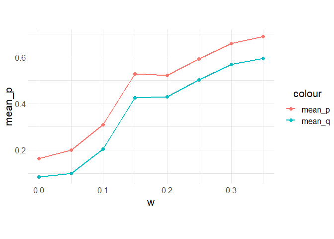

Graphing
================
Mira Flynn, Hazel Smith

  - [Original Paper Replication](#original-paper-replication)

``` r
library(tidyverse)
```

    ## -- Attaching packages -------------------------------------------------------------------------------------- tidyverse 1.3.0 --

    ## v ggplot2 3.3.1     v purrr   0.3.4
    ## v tibble  3.0.1     v dplyr   1.0.0
    ## v tidyr   1.1.0     v stringr 1.4.0
    ## v readr   1.3.1     v forcats 0.5.0

    ## -- Conflicts ----------------------------------------------------------------------------------------- tidyverse_conflicts() --
    ## x dplyr::filter() masks stats::filter()
    ## x dplyr::lag()    masks stats::lag()

``` r
library(viridis)
```

    ## Warning: package 'viridis' was built under R version 4.0.2

    ## Loading required package: viridisLite

## Original Paper Replication

``` r
df_ultimatum <- read.csv("data/data.csv")
```

``` r
df_ultimatum_means <- df_ultimatum %>%
  group_by(idx, n, r, w, nPerRound, num_steps) %>%
  # summarize(
  #   mean_p = mean(mean_p)/((max(nPerRound))-1),
  #   mean_q = mean(mean_q)
  # )
  summarize(
    mean_p = mean(mean_p),
    mean_q = mean(mean_q)
  )
```

    ## `summarise()` regrouping output by 'idx', 'n', 'r', 'w', 'nPerRound' (override with `.groups` argument)

``` r
df_ultimatum_means %>%
  filter(nPerRound == 2, num_steps == 100000) %>%
  ggplot() +
  geom_line(aes(x = w, y = mean_p, color = "mean_p"), size = 1) +
  geom_line(aes(x = w, y = mean_q, color = "mean_q"), size = 1) +
  geom_point(aes(x = w, y = mean_p, color = "mean_p"), size = 2) +
  geom_point(aes(x = w, y = mean_q, color = "mean_q"), size = 2) +
  theme_common() + 
  labs(
    title = "2 players per round",
    y = "p, q"
  )
```

<!-- -->

``` r
df_ultimatum %>%
  filter(nPerRound == 2, num_steps == 100000) %>%
  group_by(idx, n, r, w, nPerRound, num_steps) %>%
  ggplot() +
  geom_line(aes(x = generation, y = mean_p, color = "mean_p")) +
  geom_line(aes(x = generation, y = mean_q, color = "mean_q")) +
  facet_wrap(~w) +
  # geom_point(aes(x = w, y = mean_p, color = "mean_p"), size = 2) +
  # geom_point(aes(x = w, y = mean_q, color = "mean_q"), size = 2) +
  theme_common()+
  # scale_x_continuous(labels = function(x) format(x, scientific = TRUE)) +
  theme(
    axis.text.x = element_text(angle=90)
  ) +
  labs(
    title = "2 players per round",
    y = "p, q"
  )
```

<!-- -->

``` r
df_ultimatum_means %>%
  filter(num_steps == 100000) %>%
  ggplot() +
  geom_line(aes(x = w, y = mean_p, color = "mean_p"), size = 1) +
  geom_line(aes(x = w, y = mean_q, color = "mean_q"), size = 1) +
  geom_point(aes(x = w, y = mean_p, color = "mean_p"), size = 2) +
  geom_point(aes(x = w, y = mean_q, color = "mean_q"), size = 2) +
  facet_wrap(~ nPerRound) +
  theme_common() +
  labs(
    title = "2, 3, and 5 players per round",
    y = "p, q"
  )
```

<!-- -->

``` r
df_ultimatum %>%
  filter(nPerRound == 3, num_steps == 100000) %>%
  group_by(idx, n, r, w, nPerRound, num_steps) %>%
  # mutate(
  #   mean_p = mean(mean_p),
  #   mean_q = mean(mean_q)
  # ) #%>%
  mutate(
    mean_p = mean_p/(nPerRound-1)
    # mean_q = mean_q*(nPerRound-1)
  ) %>%
  ggplot() +
  geom_line(aes(x = generation, y = mean_p, color = "mean_p")) +
  geom_line(aes(x = generation, y = mean_q, color = "mean_q")) +
  facet_wrap(~w) +
  # geom_point(aes(x = w, y = mean_p, color = "mean_p"), size = 2) +
  # geom_point(aes(x = w, y = mean_q, color = "mean_q"), size = 2) +
  theme_common()+
  # scale_x_continuous(labels = function(x) format(x, scientific = TRUE)) +
  theme(
    axis.text.x = element_text(angle=90)
  ) +
  labs(
    title = "3 players per round",
    y = "p, q"
  )
```

<!-- -->

``` r
df_ultimatum %>%
  filter(nPerRound == 5, num_steps == 100000) %>%
  group_by(idx, n, r, w, nPerRound, num_steps) %>%
  # mutate(
  #   mean_p = mean(mean_p),
  #   mean_q = mean(mean_q)
  # ) #%>%
  mutate(
    mean_p = mean_p/(nPerRound-1)
    # mean_q = mean_q*(nPerRound-1)
  ) %>%
  ggplot() +
  geom_line(aes(x = generation, y = mean_p, color = "mean_p")) +
  geom_line(aes(x = generation, y = mean_q, color = "mean_q")) +
  facet_wrap(~w) +
  # geom_point(aes(x = w, y = mean_p, color = "mean_p"), size = 2) +
  # geom_point(aes(x = w, y = mean_q, color = "mean_q"), size = 2) +
  theme_common()+
  # scale_x_continuous(labels = function(x) format(x, scientific = TRUE)) +
  theme(
    axis.text.x = element_text(angle=90)
  ) +
  labs(
    title = "5 players per round",
    y = "p, q"
  )
```

<!-- -->
