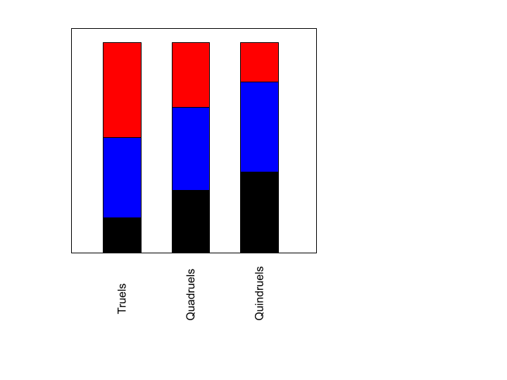
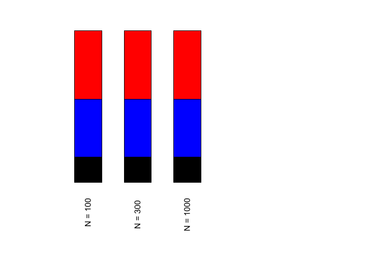

# Hunger Games
## When The Strongest Survive in n-Person Duels

Neel Dhulipala and Hazel Smith

## Abstract
In this project, we plan to explore the outcomes of n-person duels. Traditional game theory suggests that in a truel, the strongest player has the highest probability of being eliminated first since the two weakest players would likely team up against the strongest player for their gain. However, in scale-free networks, where each competitor is represented by a node, this paradox holds untrue in both single-run and Monte-Carlo simulations, according to [1]. We plan to use the NetworkX library to create Barabasi-Albert graphs with similar properties to such scale-free networks, and through these simulations, we aim on exploring under what conditions do the strongest players win and when they lose.

## Annotated Bibliography

[1] Wegener, M., Mutlu, E. The good, the bad, the well-connected. Int J Game Theory 50, 759–771 (2021). https://doi.org/10.1007/s00182-021-00765-1

"The authors present a question about the survival probability of players/competitors in truels (duels with 3 participants). While some suggest that in a singular truel with one strongest player, that strongest player has the least likelihood of survival since the other two players will target that player first, Wegerer and Mutlu find that this may not hold at scale. Through the usage of scale-free networks, they model the outcomes of many truels to predict survival probabilities for many different truels leading into each other. Using different probabilities and marksmanship abilities, this model can be simulated for prediction. There is room to explore different ways to approach the way the truel is simulated and add players to make quadruels." (Added by David Tarazi)

[2] Amengual, P., & Toral, R. (2006). Truels, or survival of the weakest. Computing in Science & Engineering, 8(5), 88-95.

TODO: Add annotated bibliography here.

## Experiment
- Create a BA graph with 300 nodes
- Assign each player(node) a marksmanship, “which can take on one of the three possible values: [0.5, 0.8, 1]. Marksmanship levels are randomly distributed in the network with equal initial proportions.” [1]
- At each step in the game: one node is chosen randomly.
	- This chosen player, in turn, randomly selects two opponents among his neighbour nodes, and the three players play a sequential truel with a fixed shooting order.
	- However, if the initially chosen player has only one neighbour, a duel occurs.
	- Moreover, players are assumed to be rational (i.e., they strictly follow the strongest opponent strategy but never aim at a player of the same type).
	- Finally, the losers of either a truel or a duel are removed from the network, and if a node has no neighbours left, it will be reattached to the network along the lines of the preferential-attachment algorithm that was used to create the scale-free network.
	- In the unlikely event that no strongest player exists because all players chosen have the same level of marksmanship, no duel or truel will be played. In this case, a new node and its neighbours will be randomly selected to continue the game.”
- The program will iterate until no more duels or truels can be played under these rules

In the paper they used a Monte-Carlo simulation to predict the average results under many simulation runs. If we have time, we can do the same.

## Extensions
There are two extension ideas that can be accomplished with this experiment. In the original experiment, the Monte-Carlo simulation was only run for N = 300 players, but with different network structures. We aim to observe the results of different numbers of N nodes to understand how different populations of players impact the results. Various populations of players can be vastly affected by these network changes, as with only 300 players, it is seen that stronger players thrived in complete graphs and lattices, but not scale-free networks. Do stronger players thrive more in smaller settings or larger settings?

Additionally, to further understand whether or not stronger players can survive in n-person duels in a scale-free network, we want to put these players in quadruels and other various n-person duels. We aim to do this by choosing a node, and instead of randomly selecting a maximum of two nodes, we select n nodes and have the players fight. While the players will still be assumed to be rational, the larger population of players may result in it being harder for the strongest players to survive, since there are more players fighting against them. For this project, we want to see for what value of n will the strongest players start losing in scale-free networks.

## Results
### Results from the paper:
Red, blue, and black are markmanships of 1, 0.8, and 0.05 respectively.
Averages are taken over 5000 simulations.
We would only be replicating the left hand most column.
Referenced from Figure 4 of [1].

### Results from Replication

The original paper did specify the shooting order for truels and their subsequent duels. However, the authors did not specify an ordering for random duels; in other words, if there was a node with only one neighbor and they were chosen to fight, the authors did not specify a shooting order. When we tried allowing the weakest player to always shoot first in a duel, the weaker players tended to survive due to having the advantage of going first, which contradicted the results of the experiment.

In the conclusion of the paper, the authors mentioned this. "As many nodes have few neighbours and truel players randomly select their potential opponents from their immediate neighbourhood, the number of duels played exceeds the number of truels in a scale-free network. In duels, however, stronger players are more likely to win and survive the competition." [1] Evidently, the paper suggests that these naturally occurring duels are truly random.

After making individual duels more random, we still get a problem in that stronger players are still losing. We realized that when replicating this, the number of truels far outnumbered the number of duels (e.g. when `n =300`, `k = 10`, and `seed=3`, there were 74,839 truels and 25,161 duels).

After attempting to troubleshoot what could be wrong, we hypothesized that the model in the original paper was flawed. We noticed in small-scaled testing that when the shooting order of the players were reversed (i.e. the strongest player shot first), the results were similar to that of the papers. As a result, we ran a Monte-Carlo simulation of that scenario. To further verify that this was the case, we redefined our model so that the nodes are arranged in a ring lattice, since the paper makes an attempt to compare scale-free networks to other types of graphs.

The two graphs above replicate the results from the new iteration with a backwards shooting order, as well as a reversed strategy where instead of targeting stronger players, weaker players are targeted instead.

### Predicted Results from Extensions

The two figures above display the predicted results of our two extensions. The first predicts that as the number *n* of people participating in these duels increases, the likelihood of stronger players surviving until the end will decrease, since they will initially face more opposition. The second predicts that changing the number of people participating in truels will have no impact on the survivability of stronger players while the proportions are similar.

## Concerns
Originally, there was a concern about the applicability of this experiment on real-world scenarios. However, the paper does suggest that, "apart from being a puzzling but purely theoretical case, a better understanding of this paradox is also crucial when it comes to evolutionary biology because it indicates that competitive skills can only be improved by mutation, not by interactions among more than two individuals in the process of natural selection." [1] If "weaker players of truels survive more than stronger players," why do we see that natural selection tends to choose stronger attributes? While this model is abstract, it does suggest why stronger players do win against weaker players, despite what traditional game theory suggests. Other applications of this model could be regarding how opinions spread.
