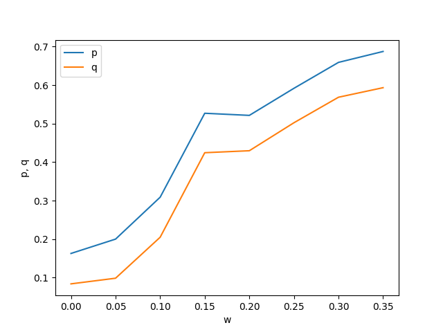
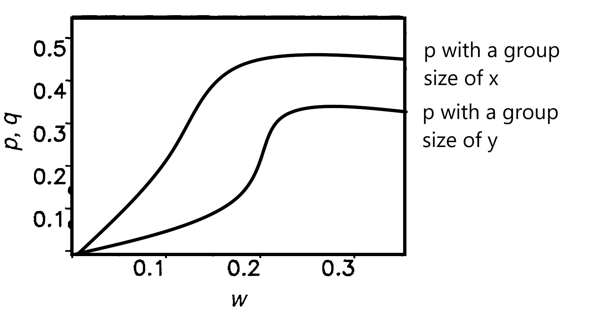

# Explorations with the Ultimatum Game
## Mira Flynn, Hazel Smith

## Abstract

Much like Prisoner's dillemma, the Ultimatum Game illustrates how behaviors which is coorporative and detrimental in the short term can prove adaptive in the long term. The Ultimatum Game is relativly simple one, two players are trying to decide how to divide a resource between them. One player, the proposer, makes a proposal to the the other and the other, the responder, chooses whether or not to accept it. If the responder chooses to accept the offer then the resource is split in that way. However, if they choose to reject the offer then both players get nothing. "Obviously, rational responders should accept even the smallest positive offer, since the alternative is getting nothing. Proposers, there- fore, should be able to claim almost the entire sum. In a large number of human studies, however, conducted with different incentives in different countries, the majority of propos- ers offer 40 to 50% of the total sum, and about half of all responders reject offers be- low 30% (1-6)." [1] We plan to recreate a evolutionary model that shows how "fair" (even split) stragegies evolve. 

## Annotated Bibliography

Nowak, Martin A.; Page, Karen M.; Sigmund, Karl, Science (Sep 8, 2000): 1773-1775. 

The authors explore why humans choose reason when playing the Ultimatum Game. According to optimal strategies, the proposing player should offer the smallest amount to the responding player; however, humans tend to be more fair when playing the Ultimatum Game. The authors made a model which evolves strategies of players to find the strategies that dominate and reach a steady state. The base game always evolves toward the optimal strategy. However, if the players are given a chance to learn about previous encounters, the players instead evolve towards fairness, replicating how real people tend to behave.

## Experiment

- For this experiemt we will create a population of n agents each with two properties p and q.
- To begin each agents p and q values will be randomly assigned. 
- "When acting as proposer, the player offers the amount p. When acting as responder, the player rejects any offer smaller than q"
- "In every generation, several random pairs are formed."
	- "The proposer will offer, whatever is smaller, [their] own p-value or the minimum offer that [they know] has been accepted by the responder during previous encounters."
	- There is also "a small (0.1) probability that proposers will make offers that are reduced by a small, randomly chosen amount (between 0 and 0.1)."
	- "Hence, p can be seen as a proposer's maximum offer, whereas q represents a responder's minimum acceptance level."
	- "Each accepted deal is made known to a fraction w of all players" 
- "Each player will be proposer on average r (50) times and be responder the same number of times."
- "The payoffs of all individuals are then summed up. For the next generation, individuals leave a number of offspring proportional to their total payoff. Offspring adopt their parent's p and q values plus a small random number from the interval (-0.005, 0.005)"
- We will run the siulation  for 10^5 generation when equlibrium should be reached and record the average p and q values for the population. We will then rerun the experiement for a range of w values to reproduce the chart shown below.

## Extensions(not yet implemented)
Our planned extension is to implement deals between more than two players. One player will propose a deal, and other players will have to accept it. We can explore both unanimous approval and majority approval. We want to explore how this affects the strategies present in both the base game and in the version with knowledge of a player's previous proposals. 

## Results
### Results from the paper:
On the x-axis is the proportion of players which learn about any one accepted deal(w.) On the y-axis is the opulation's average q (minimum acceptance) and average p(maximum offer.)

### Our Results: 
Here is our replication results. Because of limited time we only completed 10^4 generations per simulation, so our results are a bit more noisy than the paper's. However, we can see that our results closely match that of the paper's. 

### Predicted Results from Extensions
We don't know exactly how changing the group size will affect the "fairness of stragegies that evolve. However, we believe that changing group size will have an effect on the model's behavior; we just don't know if a larger group will make the population more or less "fair"

## Concerns

One concern we have is that the strategies will essentially not be affected by the number of people participating in the deal. We certainly could see that with multi-player deals, strategies evolve in the same way as with 2-player deals. However, we could also find that there are more dynamics at play, where the optimal strategy is different with multiple players. 

Another concern we have is the amount of stuff going on outside of this class. This semester has been a very busy one, and will likely continue to be very taxing on us. We want to scope our project appropriately to not overwhelm ourselves. 

## Next Steps (for this week)

Our next steps on this project are to clean up our replication and then begin the extensions. We only just got the replication working, so we want to spend a bit longer on that making sure the code is clean and readable before moving on to expansions.

