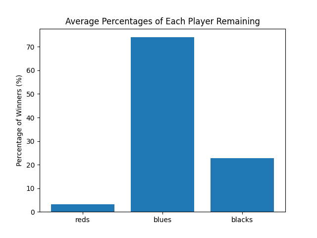
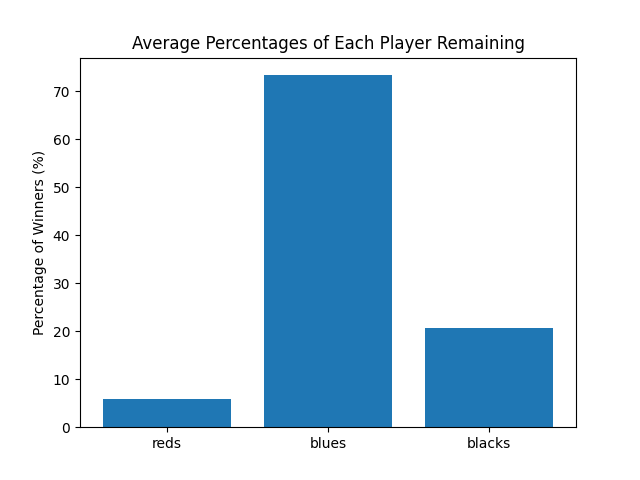
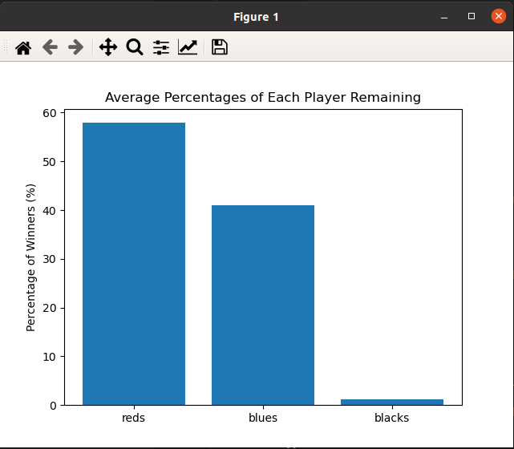
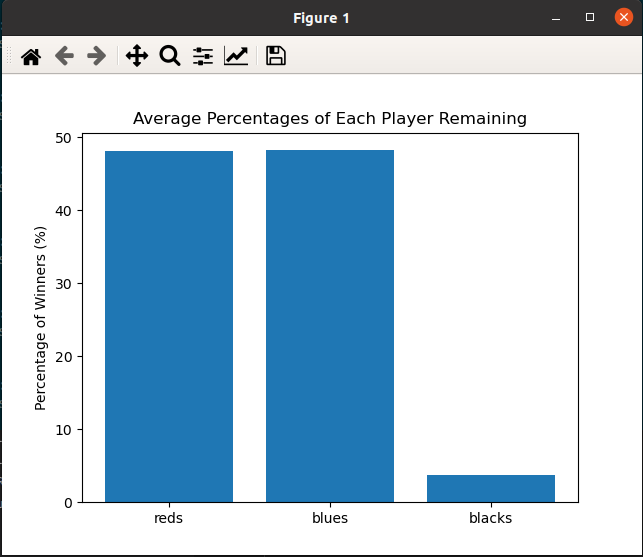

# Hunger Games
## When The Strongest Survive in n-Person Duels
Neel Dhulipala and Hazel Smith

### Abstract
Game theory has long been used to explain behaviors found in fields like evolutionary biology and sociology to show why sometimes counterintuitive behaviors, like altruism, exist. However, sometimes game theory predicts actions which we do not observe in the real world. This paper is about one such paradox: the “survival of the weakest” in truels. (A truel is a three-player duel in which three players with different marksmanship take turns trying to eliminate each other until only one player remains.) Truels are useful models to model and actual physical confrontation or to model more abstract battles, like opinion spreading. If there are three or more factions on a subject, players with the most convincing opinion are the most likely to persuade the rest of the players to adopt that opinion, even if the less persuasive opinions try to counter the stronger opinion. [2] In “Truels, or survival of the weakest. Computing in Science & Engineering,”  Amengual et al. show that, if all players follow an optimal strategy, the player with the median marksmanship (not the strongest or weakest) is most likely to win. This raises the question of why do we see weaker players winning on the micro-scale (single truels) but strongest (fittest) players winning on the macro-scale (evolution). Wegener and Mutlu seem to find a solution to this paradox in their paper “The good, the bad, the well-connected” where they show that the strongest player does win if the truels take place in a scale-free network. In this paper, we attempt to replicate the Wegener and Mutlu model, but instead only find results that support the results found from traditional game theory.

### Methodology

We start by trying to replicate the model by following the experimental procedures laid out in our original model. The original instructions are to first create a Barabasi Albert graph with 300 nodes. Assign each player (node) a marksmanship, “which can take on one of the three possible values: [0.5, 0.8, 1]. Marksmanship levels are randomly distributed in the network with equal initial proportions.” [1] At each step in the game: one node is chosen randomly.
  - This chosen player, in turn, randomly selects two opponents among his neighbor nodes, and the three players play a sequential truel with a fixed shooting order.
  - However, if the initially chosen player has only one neighbor, a duel occurs.
  - Moreover, players are assumed to be rational (i.e., they strictly follow the strongest opponent strategy but never aim at a player of the same type).
  - Finally, the losers of either a truel or a duel are removed from the network, and if a node has no neighbors left, it will be reattached to the network along the lines of the preferential-attachment algorithm that was used to create the scale-free network.
  - In the unlikely event that no strongest player exists because all players chosen have the same level of marksmanship, no duel or truel will be played. In this case, a new node and its neighbors will be randomly selected to continue the game.”
The program will iterate until no more duels or truels can be played under these rules.

Wegener and Mutlu use a Monte-Carlo simulation to predict the average results under many simulation runs, as do we. The idea of a Monte-Carlo simulation is to run a simulation many times with slightly different initial conditions. For each Monte-Carlo simulation, we run a singular starting condition ten times. Since we are limited by computing power, we are not able to execute the 5000 simulations Wegener and Mutlu accomplish, so we perform 20 different simulations instead.

While the paper does specify the shooting order for truels and their subsequent duels, the authors do not specify an ordering for random duels. In other words, if there was a node with only one neighbor and they were chosen to fight, the authors do not specify a shooting order. The original paper also does not specify the average degree of the nodes (a “*k*” value) for the Barabasi Albert graph.

### Results

In the original model, players with probabilities p = 1.0, p = 0.8, and p = 0.5 to win a duel are labeled as red, blue, and black, respectively. Figure 1 shows the results from their findings.

**Figure 1**: Bar graph displaying the survivability of red, blue, and black players. The length of the section of each bar represents their percentage of survivability.

Under scale-free networks, stronger players survive in the majority at approximately 54%, whereas blue and black players represented only 46% of those who survived. In the other two scenarios, i.e. lattice and complete graphs, red players make up the minority of surviving players; that is, as the connectivity between players increases, the probability that a strong player will survive decreases. Wegener and Mutlu argue that since many nodes have few neighbors and few nodes have many neighbors, there is going to be a high number of duels compared to truels. Even if stronger players do not have the advantage in sequential truels, where they shoot last, they have a substantial advantage in duels due to their high marksmanship.

<table><tr>
<td>  </td>
<td>  </td>
</tr></table>

**Figure 2**: Two bar graphs showing the average percentages of surviving red, blue, and black players competing in a scale-free network over 20 Monte-Carlo simulations. In these simulations, *n* = 300 and *k* = 10, which are the same values used in the original paper. The first graph shows the results with the implementation of sequential duels where the weaker players shoot first while the second shows the results of implementation with random duels, where the shooting order is random.

In our attempts at replicating the experiment, our results are different. Figure 2 shows the results of running 20 simulations for two different interpretations of what duels are. Since the paper does not clarify whether the duels were supposed to be random or sequential, we replicate the experiment with both cases. Despite how stronger players traditionally thrive in random duels, both implementations seem to garner the same results. We also replicate the experiment with different values of k and even different implementations of key functions (i.e the reattachment function.) All of these results in the blue players (median players) being most likely to survive and not red players (strongest players) like Wegener and Mutlu predict.

A possible reason for the difference in results is despite how nodes in scale-free networks on average have few neighbors, the preferential attachment algorithm Wegener and Mutlu describe in the paper gives players a high degree. This means that when a node becomes isolated, it reattaches itself to at least two other nodes on average, which increases the number of truels that occur. Additionally, decreasing the value of k did lead to slightly better results but not by much due to how often nodes need to be reattached.

In one of our runs, we accidentally reversed the shooting order and strategy of players in our truels, by changing one line of code. The strongest player now shoots first and the players play with the least optimal strategy (i.e. they aim at the opponent which poses less of a risk to them.) In doing this, we find that our results are similar to Wegener and Mutlus’, with a red survival probability of about 57%. To further check that this replication is the same as the original paper’s, we try the experiment again with the reversed order, but this time on lattice graphs. Again we find that our results are similar to Wegener and Mutlus’ when they ran their experiment on a lattice graph, with the probability of stronger red players surviving at approximately 47% compared to the original paper’s 43% survivability rate.

<table><tr>
<td>  </td>
<td>  </td>
</tr></table>

**Figure 3**: Survivability of red, blue, and black players in both scale-free and lattice models over 20 simulations using the adjusted shooting order and strategy. The percentages of survivability in this figure are similar if not identical to those in Figure 1 for scale-free and lattice graphs. In both graphs, *n* = 300 and *k* = 2, since lower k values result in the reattachment function proving fairer for the stronger players.

### Conclusion

As the only time that we can replicate Wegener and Mutlus’ results are when we deviate from their stated experimental procedure, we do not think that playing truels in scale-free networks does provide a solution to the “survival of the weakest” paradox. Our model instead supports the results from traditional game theory.

#### Further Exploration

We hypothesize that the paradox of the “survival of the weakest” might not be inherent to truels but rather a product of the artificial constraints placed on shooting order. Amengual, et al. explored both random shooting order and sequential truels (with the weakest player shooting first) However, it might make sense if the player that was most likely to shoot first was also the player with the highest marksmanship. For example, the probability that a player shoots first could be [player’s marksmanship] / [sum of marksmanship for all players.] This might produce a result where the strongest player does tend to win even if all players play with optimal strategy.

### Annotated Bibliography

[1] Wegener, M., Mutlu, E. The good, the bad, the well-connected. Int J Game Theory 50, 759–771 (2021). https://doi.org/10.1007/s00182-021-00765-1

"The authors present a question about the survival probability of players/competitors in truels (duels with 3 participants). While some suggest that in a singular truel with one strongest player, that strongest player has the least likelihood of survival since the other two players will target that player first, Wegerer and Mutlu find that this may not hold at scale. Through the usage of scale-free networks, they model the outcomes of many truels to predict survival probabilities for many different truels leading into each other. Using different probabilities and marksmanship abilities, this model can be simulated for prediction. There is room to explore different ways to approach the way the truel is simulated and add players to make quadruels." (Added by David Tarazi)

[2] Amengual, P., & Toral, R. (2006). Truels, or survival of the weakest. Computing in Science & Engineering, 8(5), 88-95. https://ieeexplore.ieee.org/stamp/stamp.jsp?arnumber=1677488

These authors use a mathematical approach to prove that the strongest player in a truel will most likely lose if every player plays with optimum strategy. Since every truel will eventually become a duel once one player is eliminated, rational players would theoretically go for the stronger players first. The strongest player will shoot the second strongest player, the second strongest player will shoot the strongest player, and the weakest player will shoot the strongest player.  With two players shooting at them the strongest player is unlikely to make it to the duel, so most times the duel is the second strongest player and the weakest player. Generally, under these conditions, the second strongest player will win. This paper explores several different rules for truels (random, sequential, etc) and a range of different marksmanship values for all three players to examine when this paradox of "survival of the weakest" occurs.
