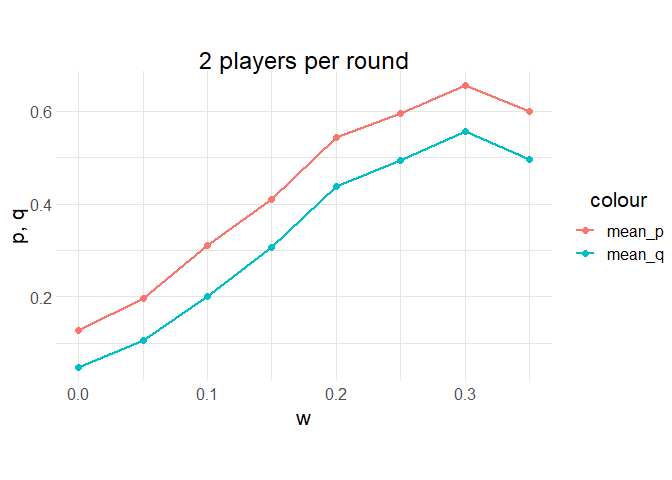
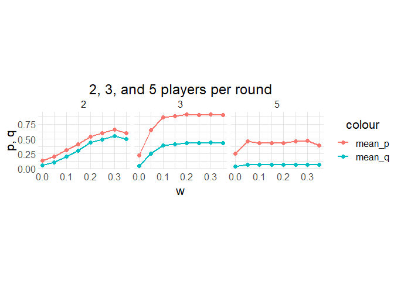

# Explorations with the Ultimatum Game
## Mira Flynn, Hazel Smith

## Abstract
Much like Prisoner's dillemma, the Ultimatum Game illustrates how behaviors which is coorporative and detrimental in the short term can prove adaptive in the long term. The Ultimatum Game is relativly simple one, two players are trying to decide how to divide a resource between them. One player, the proposer, makes a proposal to the the other and the other, the responder, chooses whether or not to accept it. If the responder chooses to accept the offer then the resource is split in that way. However, if they choose to reject the offer then both players get nothing. In a one off game a purely rational player should accept any offer above 0, as it is better to get something than nothing. It is also therefore logical to offer the lowest amount possible since the other rational player will accept. However, in a population where players might learn about other players past behavior there is benefit to being more cautious with your acceptances and more generous with your offers, as if it is learned that a player will accept low offers they are unlikely to recieve high ones. This was the thesis proposed by Nowak et. al. in their paper. We recreated their model and replicated their results. From that we wondered, how system dynamics would change if an offer had to be made to an entire group and only the majority of responders needed to accept.

## Methodology
### Replication 
- For this experiment we will create a population of n agents each with two properties p and q.
- To begin each agents p and q values will be randomly assigned. 
- In each round a pair will randomly formed. One player will be assigned to be the proposer and the other will be the resonder. 
  - The proposer will offer their maximum offer, p, or the lowest value that they know the responder has accepted, whichever is lower.
    - There is also a 0.1 probability that proposers will lower their offer by an random small amount (less than 0.1.)
  - The responder will accept any offer greater than their minimum acceptable offer, q. 
  - If the offer is accepted the players will gain their respective amounts. (The responder will gain the offer amount; the proposer will gain 1 - offer.)
  - The accepted deal is made known to a proportion of players, w.
- Rounds will procede until each player has been both a proposer and a responder an average of r (50) times each. 
- The culumative payoff of all indivduals are then used to determine the number of offspring they leave for the next genreation (i.e "individuals leave a number of offspring proportional to their total payoff")
- "Offspring adopt their parent's p and q values plus a small random number from the interval (-0.005, 0.005)"
- We ran the siulation  for 10^4 generation when equlibrium should be reached and record the average p and q values for the population. We will then rerun the experiement for a range of w values to reproduce the chart shown below.

### Extension
For our extension much of the model above stayed the same, except that instead of only offering to one player the propser is now making an offer to a group of reponders the majority of which need to accept the offer in order for it to be accepted. 
- The number of players in 1 + the number of responders (all players are responders, except the single proposer)
- p now represents the total amount of money the a proposer will offer. They will now offer (p / (number of responders)) or the lowest value that they know the responder has accepted, whichever is lower, to each responder
- Each responder will then consider their individual offer and reject or accept it. 
- If the majority (> 50%) of responders accept the offer then each player will gain their respective amounts. (The responder will gain their offer amount; the proposer will gain 1 - (sum of offers).)
- Note: when num_player = 3, the decision must be unanimous as the only way to get the majority of 2 responders to accept is to get both of them accept.

## Results from Replication 
<table><tr>
<td>  </td>
<td>  </td>
</tr></table>

**Figure 1**: On the x-axis is the proportion of players which learn about any one accepted deal (w). On the y-axis is the population's average q (minimum acceptance) and average p (maximum offer.)

In both our replication and the original paper the greater the proportion of players who find out about any particular deal the more generous (higher p values) and selective (higher q values) the population becomes on average. Our replication has a lower intial slope, but does not stabilize as quickly as the original paper did. (The graph of the original paper flattens at about w = 0.15 and ours does not.) 

## Results from Extension
<table><tr>
<td>  </td>
</tr></table>

**Figure 2**: p and q vs. w for different number of players. 

Our extension results show that the evolution towards fairness is not present when there are 3 or 5 players in each round.

In the case of 3 players, for small W values, the proposer only offers a small portion of their money, and the responder likewise accepts small offers. Above W = 0.1, the system evolves towards the proposer offering almost all their money (above 87.5%) to the responders, and responders accepting an offer only if it is near 50% of the total money. The 3 player case is not fair to the proposer, as the proposer gets substantially less than 1/n of the total money.

In the case of 5 players, the system dynamics are nearly constant for all W values. The proposer offers just under half the money, and responders will accept anything close to or above their 1/4th of the remaining money. The 5 player case is now unfair to the responders, who each will get substantially less than the proposer.

## Conclusion

## Further Exploration

## Annotated Bibliography

[Collective dynamics of 'small-world' networks](../Original_Paper.pdf)

Nowak, Martin A.; Page, Karen M.; Sigmund, Karl, Science (Sep 8, 2000): 1773-1775. 

The authors explore why humans choose reason when playing the Ultimatum Game. According to optimal strategies, the proposing player should offer the smallest amount to the responding player; however, humans tend to be more fair when playing the Ultimatum Game. The authors made a model which evolves strategies of players to find the strategies that dominate and reach a steady state. The base game always evolves toward the optimal strategy. However, if the players are given a chance to learn about previous encounters, the players instead evolve towards fairness, replicating how real people tend to behave.