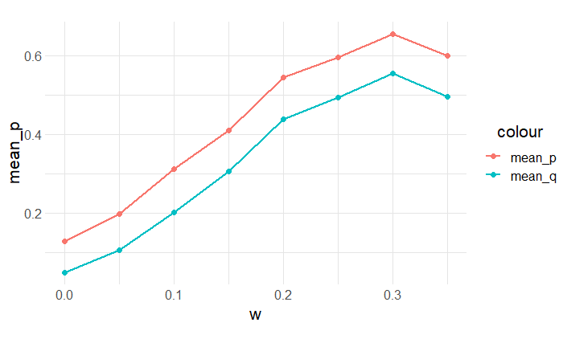

# Explorations with the Ultimatum Game
## Mira Flynn, Hazel Smith

## Abstract
Much like Prisoner's dillemma, the Ultimatum Game illustrates how behaviors which is coorporative and detrimental in the short term can prove adaptive in the long term. The Ultimatum Game is relativly simple one, two players are trying to decide how to divide a resource between them. One player, the proposer, makes a proposal to the the other and the other, the responder, chooses whether or not to accept it. If the responder chooses to accept the offer then the resource is split in that way. However, if they choose to reject the offer then both players get nothing. In a one off game a purely rational player should accept any offer above 0, as it is better to get something than nothing. It is also therefore logical to offer the lowest amount possible since the other rational player will accept. However, in a population where players might learn about other players past behavior there is benefit to being more cautious with your acceptances and more generous with your offers, as if it is learned that a player will accept low offers they are unlikely to recieve high ones. This was the thesis proposed by Nowak et. al. in their paper. We recreated their model and replicated their results. From that we wondered, how system dynamics would change if an offer had to be made to an entire group and only the majority of responders needed to accept.

## Methodology
### Replication 
- For this experiemt we will create a population of n agents each with two properties p and q.
- To begin each agents p and q values will be randomly assigned. 
- "When acting as proposer, the player offers the amount p. When acting as responder, the player rejects any offer smaller than q"
- "In every generation, several random pairs are formed."
  - "The proposer will offer, whatever is smaller, [their] own p-value or the minimum offer that [they know] has been accepted by the responder during previous encounters."
  - There is also "a small (0.1) probability that proposers will make offers that are reduced by a small, randomly chosen amount (between 0 and 0.1)."
  - "Hence, p can be seen as a proposer's maximum offer, whereas q represents a responder's minimum acceptance level."
  - "Each accepted deal is made known to a fraction w of all players" 
- "Each player will be proposer on average r (50) times and be responder the same number of times."
- "The payoffs of all individuals are then summed up. For the next generation, individuals leave a number of offspring proportional to their total payoff. Offspring adopt their parent's p and q values plus a small random number from the interval (-0.005, 0.005)"
- We will run the siulation  for 10^5 generation when equlibrium should be reached and record the average p and q values for the population. We will then rerun the experiement for a range of w values to reproduce the chart shown below.
### Extension

## Results from Replication 
<table><tr>
<td>  </td>
<td>  </td>
</tr></table>
**Figure 1**: On the x-axis is the proportion of players which learn about any one accepted deal(w.) On the y-axis is the opulation's average q (minimum acceptance) and average p(maximum offer.)

## Results from Extension
<table><tr>
<td>  </td>
</tr></table>
**Figure 2**: p and q vs w for different number of players

## Conclusion

## Further Exploration

## Annotated Bibliography

Nowak, Martin A.; Page, Karen M.; Sigmund, Karl, Science (Sep 8, 2000): 1773-1775. 

The authors explore why humans choose reason when playing the Ultimatum Game. According to optimal strategies, the proposing player should offer the smallest amount to the responding player; however, humans tend to be more fair when playing the Ultimatum Game. The authors made a model which evolves strategies of players to find the strategies that dominate and reach a steady state. The base game always evolves toward the optimal strategy. However, if the players are given a chance to learn about previous encounters, the players instead evolve towards fairness, replicating how real people tend to behave.