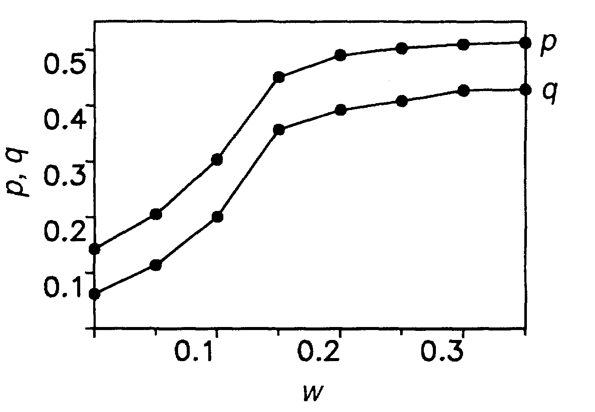

# Explorations with the Ultimatum Game
## Mira Flynn, Hazel Smith

## Abstract

Much like Prisoner's dillemma, the Ultimatum Game illustrates how behaviors which is coorporative and detrimental in the short term can prove adaptive in the long term. The Ultimatum Game is relativly simple one, two players are trying to decide how to divide a resource between them. One player, the proposer, makes a proposal to the the other and the other, the responder, chooses whether or not to accept it. If the responder chooses to accept the offer then the resource is split in that way. However, if they choose to reject the offer then both players get nothing. "Obviously, rational responders should accept even the smallest positive offer, since the alternative is getting nothing. Proposers, there- fore, should be able to claim almost the entire sum. In a large number of human studies, however, conducted with different incentives in different countries, the majority of propos- ers offer 40 to 50% of the total sum, and about half of all responders reject offers be- low 30% (1-6)." [1] We plan to recreate a evolutionary model that shows how "fair" (even split) stragegies evolve. 

## Annotated Bibliography

## Experiment
- For this experiemt we will create a population of n agents each with two properties p and q.
- To begin each agents p and q values will be randomly assigned. 
- "When acting as proposer, the player offers the amount p. When acting as responder, the player rejects any offer smaller than q"
- "In every generation, several random pairs are formed."
	-"The proposer will offer, whatever is smaller, [their] own p-value or the minimum offer that [they know] has been accepted by the responder during previous encounters."
	- There is also "a small probability that proposers will make offers that are reduced by a small, randomly chosen amount."
	- "Hence, p can be seen as a proposer's maximum offer, whereas q rep- resents a responder's minimum acceptance level."
	- "Each accepted deal is made known to a fraction w of all players" 
- "Each player will be proposer on average r times and be responder the same number of times."
- "The payoffs of all individuals are then summed up. For the next generation, individuals leave a number of offspring proportional to their total payoff. Offspring adopt the strategy of their parents, plus or minus some small random value."
- We will run the siulation until steay state is reached and record the average p and q values for the population. We will then rerun the experiement for a range of w values to reproduce the chart shown below.
## Extensions

## Results

### Results from the paper:

-
### Predicted Results from Extensions

## Concerns

## Next Steps (for this week)

